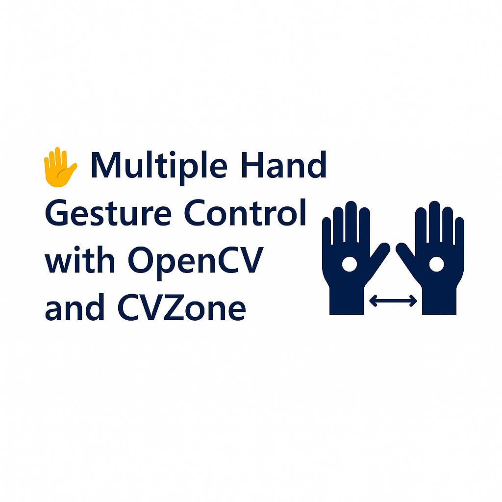

# 🤚 Multiple Hand Gesture Control with OpenCV and CVZone


## 🎥 Demo Video

[▶️ Click to Watch Demo Video](https://raw.githubusercontent.com/roya-ghasemi/Multiple-Hand-Gesture-Control-Python/main/chose.mp4)

This project is a practical example of multi-hand gesture detection and control...


This project is a practical example of multi-hand gesture detection and control using the OpenCV and CVZone libraries in Python. With this code, you can simultaneously track two hands and measure the distance between them.

## 🚀 Features

* Simultaneous detection and tracking of two hands
* Accurate calculation of the distance between the two hands
* Graphical display of results on webcam feed

## 🛠 Technologies Used

* **Python 3.10**
* OpenCV
* CVZone

## 📦 Installation

Ensure you're using **Python 3.10** to run this project:

```bash
pip install opencv-python cvzone
```

## 🖥 How to Run

After installing the dependencies, run the script with:

```bash
python hand_gesture_control.py
```

Press `q` to exit the program.

## 📂 Project Structure

```
.
├── hand_gesture_control.py
└── README.md
```

## 💡 Ideas for Further Development

* Volume control or zoom functionality using hand gestures
* Detecting and classifying various hand gestures
* Controlling different software applications via predefined gestures

## 🙌 Acknowledgments

This code was inspired by CVZone tutorial content.

## 📜 License

This project is released under the MIT License.
